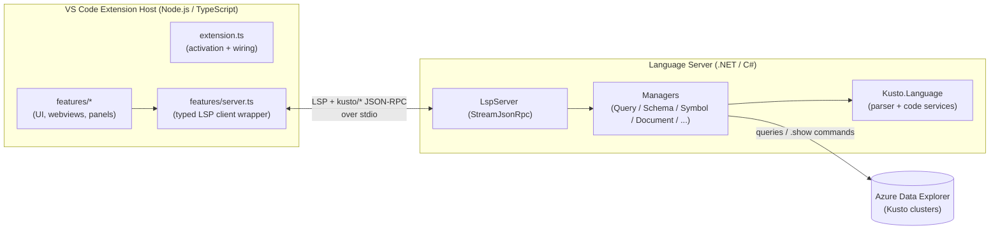
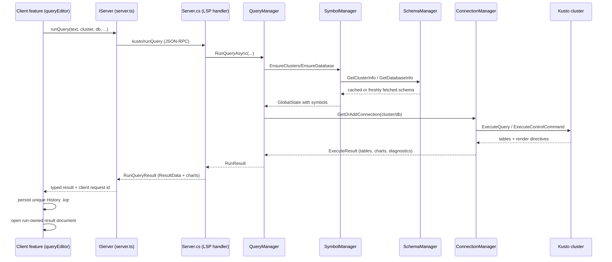

# Architecture Overview

This document explains how the Kusto Explorer for VS Code extension is put together: its major
components, how they communicate, and the design intent behind the structure. It is aimed at
contributors who need to understand *why* the code is shaped the way it is before changing it.

For build/debug/packaging steps see [CONTRIBUTING.md](CONTRIBUTING.md). For the end-user feature
walkthrough see the [User Guide](src/Client/README.md).

---

## 0. What this product is

The Kusto VS Code extension is meant to **mimic the desktop Kusto Explorer application, but running
inside VS Code**. Its initial focus is the core loop of that experience:

- basic editing of **multi-query KQL files**,
- **executing queries**, and
- **displaying results as tables and charts**.

Several features are deliberately modeled on their desktop Kusto Explorer equivalents — for example
**scratch pads** and **query history** exist to reflect the same concepts users already know from the
desktop app.

**Scope is intentionally partial.** Not every desktop Kusto Explorer feature has a representation in
the extension today. Which capabilities the extension gains in the future depends on **feedback from
the community** rather than a fixed roadmap. When weighing a change, favor parity with the desktop
experience where it makes sense, and treat the desktop app as the reference point for how a feature
"should" feel.

**The relationship isn't one-way, though** — some capabilities are *new to the extension* and have no
desktop Kusto Explorer equivalent:

- **Saving results as `.kqr` files** — a result set can be saved to a shareable file that can be
  reopened and viewed later, independent of re-running the query.
- **The chart editor** — an interactive UI for customizing a chart (type, axes, series, title, etc.)
  rather than being limited to whatever the query specified.
- **Charting without the `render` operator** — charts can be created directly from query results in
  the UI, so visualizing data doesn't require adding a `render`/chart operator to the KQL.

So the extension is best understood as "desktop Kusto Explorer's core experience, brought into
VS Code, plus a few VS Code-native conveniences" — not a strict subset.

**A primary motivation for being in VS Code at all is AI.** Bringing the Kusto Explorer experience
into VS Code gives users direct access to **AI agents (e.g. Copilot) that can see, create, edit, and
run their queries** in context. The editor host already understands the active `.kql` document, the
connected cluster/database, and the schema, so an agent can be wired into that same context to author
and diagnose KQL alongside the user. Beyond the document, the agent is given a set of **Kusto tools**
that let it understand and explore schemas (clusters, databases, tables, columns, functions),
**run queries**, inspect saved History results by exact client request id (CID), and even **render
charts** for the results it gets back — so it can investigate the data the way a user would, not
just write text. This is exposed through the language-model tools
registered in [src/Client/features/copilot.ts](src/Client/features/copilot.ts) (see §3.3), and it is
a first-class reason the product lives here rather than only on the desktop.

---

## 1. The big picture: a two-process extension

The extension is split into two cooperating processes that talk over the **Language Server Protocol
(LSP)** plus a set of **custom Kusto JSON-RPC methods**:

### Why two processes?

- **Performance, not availability, is the real reason.** A JavaScript translation of the Kusto parser
  (`Kusto.Language`) exists and is used by other web-based editors, so running the language services
  in-process in the Node extension host was entirely possible. The native .NET build was chosen
  because parsing and semantic analysis run roughly **50x faster** in a .NET process than the
  JavaScript version does. That speed difference is what keeps typing responsive on large queries (or
  queries that are *indirectly* large — e.g. small text that expands against a big schema), where the
  parser is re-running constantly as the user types.
- **The UI must live in the VS Code extension host (Node).** Webviews, tree views, commands, and the
  Activity Bar are all JavaScript surfaces, so a separate host process is unavoidable regardless of
  where parsing happens.
- **LSP is the natural seam.** Standard editor features (completion, hover, diagnostics, formatting,
  go-to-definition, rename, semantic tokens) map directly onto LSP. Everything Kusto-specific that
  doesn't fit LSP (running queries, fetching schema, decoding connection strings) is added as custom
  `kusto/*` JSON-RPC methods over the same channel.

### The `NullServer` fallback (a test affordance, not a usage mode)

`IServer` has a `NullServer` implementation (see
[src/Client/features/server.ts](src/Client/features/server.ts)) that returns safe defaults. If .NET
or `Server.dll` is unavailable, `extension.ts` substitutes it so the extension still activates and UI
features still register.

**This exists purely to let unit/integration tests run without standing up a full .NET language
server — it is not a supported end-user mode.** With `NullServer` in place there is no real language
intelligence (completion, diagnostics, query execution, schema), so it is only useful for exercising
the client's UI wiring in isolation. Don't design features around it as if it were a degraded-but-
functional runtime; treat a missing server as a test/dev condition, not a shipping configuration.

### A note on history: from "an LSP server" to "a VS Code extension"

The project began as an attempt to build a **general-purpose Kusto LSP server** that any editor could
host. As it evolved, so many VS Code-specific capabilities (webview-based results and charts, the
connections tree, scratch pads, history, host-bridged authentication, etc.)
improved the experience that the LSP server increasingly needed *custom*, non-standard communication
to support them. At that point the focus deliberately shifted from "a portable language server" to
"a good VS Code extension."

The architecture still rests on the LSP infrastructure, and that is intentional: for the parts the
server genuinely does — the standard editor language services — LSP does the job well enough that a
custom protocol would add nothing. So LSP remains the backbone for those features, while the
Kusto-specific work that LSP doesn't model is layered on as custom `kusto/*` JSON-RPC methods over
the same channel. **Practical consequence:** don't treat editor-agnosticism as a hard design
constraint — the codebase optimizes for the VS Code experience first, and reuses LSP where it pays
its own way rather than for portability's sake.

---

## 2. Repository layout

| Path | Description |
|------|-------------|
| `KustoExplorerVscode.slnx` | Visual Studio solution spanning the whole extension |
| `src/Client` | TypeScript VS Code extension — UI, LSP client, all editor-host features |
| `src/Server` | C# LSP server — Kusto parser integration and language/query services |
| `src/ServerTests` | C# tests for the server |
| `src/Client/tests` | TypeScript unit (`vitest`) and integration tests |

The client `package.json` declares all VS Code contributions (commands, menus, views, settings,
the `kusto` language, the scratch-pad/entity-definition URI schemes). The build (`npm run compile`)
uses **esbuild**; the debug server is produced by `build-debug-server`.

---

## 3. The Client (TypeScript extension host)

### 3.1 Activation and wiring — `extension.ts`

[src/Client/extension.ts](src/Client/extension.ts) is the composition root. It:

1. Creates the `Kusto` output channel early.
2. Tries to launch the .NET language server (`dotnet Server.dll vscode`) via
   `vscode-languageclient`. On success it wraps the `LanguageClient` in the typed `Server` class;
   on failure it uses `NullServer`.
3. Constructs every feature object, injecting the shared `IServer`, `ConnectionManager`,
   `Clipboard`, etc., and registers their commands on the extension context.
4. Returns a small object of internals (`historyManager`, `connectionManager`, `resultsViewer`,
   `server`) so **integration tests** can drive the extension.

**Design intent:** dependencies flow one way — `extension.ts` builds the graph and hands
collaborators down by constructor injection. Features depend on the `IServer` *interface*, never on
the concrete `LanguageClient`, which keeps them testable and server-agnostic.

### 3.2 The typed server seam — `features/server.ts`

`IServer` is the single typed contract for everything the client asks of the language server:
`runQuery`, `getQueryResultType`, `getDatabaseInfo`, `validateQuery`, `refreshSchema`, entity and
paste helpers, plus notifications in both directions. The concrete `Server`:

- Centralizes every custom `kusto/*` request so return-type signatures live in one place.
- **Bridges host capabilities back to the server** via `client.onRequest` handlers:
  - `kusto/getData` / `kusto/setData` → VS Code `globalState` (lets the server persist across
    sessions without owning storage).
  - `kusto/getAuthenticationToken` → VS Code's built-in Microsoft authentication. **Design intent:**
    sign-in UI lives in the host window, not in the server process, which avoids
    "non-interactive environment" failures on remote-SSH / WSL / Codespaces and gives users one place
    (the Accounts gear) to manage credentials.

`NullServer` implements the same interface with no-ops/defaults.

### 3.3 Feature modules — `features/*`

Features are grouped by responsibility. Key ones:

| Area | Modules | Responsibility |
|------|---------|----------------|
| **Connections** | `connectionManager.ts`, `connectionsPanel.ts`, `connectionStatusBar.ts`, `authentication.ts` | Persist clusters/groups (in `globalState`) and per-document cluster/database assignments (in `workspaceState`); render the Connections tree; show the active connection in the status bar; acquire AAD tokens. |
| **Query editing** | `queryEditor.ts`, `markdown.ts` | Run/format/copy queries; CodeLens-driven selection; paste transforms; document schema refresh. |
| **Results** | `resultsViewer.ts`, `dataTableProvider.ts`, `activityTree.ts`, `webview.ts`, `html.ts`, `tsv.ts` | Display query results in webviews; tabular and activity-structured grids (`simple-datatables`); copy/export; drag-and-drop as `datatable` expressions. |
| **Charts** | `chartProvider.ts`, `compositeChartProvider.ts`, `chartEditorProvider.ts`, `plotlyChartProvider.ts`, `graphChartProvider.ts`, `timePivotChartProvider.ts` | Render and edit charts from results; save as `.kqr`; copy as image. |
| **Scratch pads** | `scratchPadManager.ts`, `scratchPadPanel.ts` | In-memory `.kql` documents (custom `kusto-scratchpad:` scheme) that need no file on disk. |
| **History** | `historyManager.ts`, `historyPanel.ts` | Record executed queries + results and let users revisit them. |
| **Entities** | `entityDefinitionProvider.ts` | Virtual read-only documents (`kusto-entity:` scheme) showing an entity's `CREATE` statement for go-to-definition. |
| **Import** | `importer.ts`, `importManager.ts` | Import connections / scratch pads from desktop Kusto Explorer. |
| **Copilot** | `copilot.ts` | Registers language-model tools so Copilot can read schema, run, and diagnose queries. |
| **Infra** | `server.ts`, `dotnet.ts`, `clipboard.ts`, `kustoLiteral.ts` | Server seam; .NET runtime discovery; clipboard; KQL literal/identifier helpers. |

**Data model vs. UI component (naming convention):** features are usually split into two cooperating
modules — a lower-level **data model** that holds state and logic and is easily unit-tested (e.g.
`historyManager.ts`, `scratchPadManager.ts`, `connectionManager.ts`, `importManager.ts`), and a
**UI component** that drives the user-facing surface (e.g. `historyPanel.ts`, `scratchPadPanel.ts`,
`connectionsPanel.ts`). If a filename reads like a UI element — `panel`, `editor`, `viewer`,
`statusBar`, etc. — it is the UI half, even when it isn't literally a subtype of a VS Code API type;
it still *manages the UI equivalent*. The manager halves carry the testable behavior; the panel/editor
halves carry the presentation. New features should preserve this split so the logic stays testable.

**Provider model (how the results editor composes its UI):** the results editor is webview-based, so
its real job is to generate the HTML that plugs into the webview. It *does* know the three broad kinds
of result content — **tabular results** (`dataTableProvider.ts`), **chart results** (the chart
providers), and **the query itself** (just text) — and it manages the **tabs** that combine them
(most visible when results are saved to and reopened from `.kqr` files). For each kind it delegates the
visually distinct portion to a **provider** that renders its own subset of HTML into a separate
`
`. Charts go further: the chart surface has *multiple* provider implementations behind a single
`IChartProvider` seam —

- `plotlyChartProvider.ts` — the common case (most chart types), rendered with Plotly.
- `timePivotChartProvider.ts` — not really a chart but an exploratory pivot tool that happens to
  present through the same provider seam.
- `graphChartProvider.ts` — node/edge graph rendering.

`compositeChartProvider.ts` superficially joins these implementations together and presents them as
one provider, so the results editor never has to know which concrete chart provider is in play — it
just asks the composite for HTML. This keeps the editor decoupled from the proliferation of chart
types and makes each provider independently testable/replaceable.

`chartEditorProvider.ts` is an additional surface the results viewer can **show/hide on demand**; it
lets the user customize many facets of a chart. Today the results viewer assumes **one chart per
result**, but that is a current limitation rather than a hard constraint — there is really no limit, and
it can be extended to allow multiple charts, each shown in its own tab exactly like multiple result
tables. The `.kqr` save format already supports specifying multiple charts.

The same content kinds also drive the two docked panels: the **results panel** at the bottom typically
shows only tabular data and the **chart panel** typically shows only charts, but both are configurable
in settings so either panel can display any mixture of tables, charts, and query text.

**Webview pattern (important convention):** webview-based features (results, charts, data table)
follow one house style — a feature class builds an HTML *string* with inline `<script>`,
uses `acquireVsCodeApi()` + document-level click delegation for events, and posts messages back to
the extension. There is **no React/bundler for webview content**; CDN libraries (Plotly, Cytoscape,
simple-datatables) are loaded directly. New webview UIs should match this pattern.

---

## 4. The Server (.NET language server)

`src/Server` is a layered set of managers behind LSP handlers. `Program.cs` just constructs a
`Server` over stdio and runs it.

### 4.1 LSP foundation — `Lsp/`

`LspServer` (base of `Server`) owns the **StreamJsonRpc** plumbing: a
`HeaderDelimitedMessageHandler` + `JsonMessageFormatter` (camelCase) over the input/output streams,
with `[JsonRpcMethod]`-attributed virtual methods mapped to LSP request names. `Server.cs` overrides
those handlers and also declares the custom `kusto/*` methods.

`OnInitializeAsync` advertises the server's capabilities: semantic tokens, completion (with trigger
characters), hover, folding, formatting, document highlight, references, definition, code actions,
and rename — each one corresponds to a Kusto code service.

### 4.2 The manager layer — `Server.cs` as coordinator

`Server` implements `ILogger`, `ISettingSource`, `IStorage`, and `IAuthenticationProvider`, and
composes the managers (it has a DI-friendly constructor and a default constructor that wires the
concrete implementations). Responsibilities are split so each manager owns one concern:

| Folder | Type(s) | Responsibility |
|--------|---------|----------------|
| `Documents/` | `DocumentManager`, `SectionedDocument`, `IDocument` | Track open documents; wrap `Kusto.Language.Editor.CodeScript`; expose per-section editor services (diagnostics, completion, hover, classification, code actions). |
| `Symbols/` | `SymbolManager` | Build and hold the shared `GlobalState` (cluster/database symbols) the parser needs; raise `GlobalsChanged`. |
| `Schema/` | `SchemaManager`, `ServerSchemaSource`, `ISchemaSource` | Fetch live schema via `.show` commands and cache it (memory + `IStorage`), with background refresh. |
| `Connections/` | `ConnectionManager`, `KustoConnection`, `IConnection` | Pool Kusto connections; execute queries/commands; handle auth fallback. |
| `Querying/` | `QueryManager` | Validate, type, and run queries — the orchestrator that ties symbols + connections together. |
| `Diagnostics/` | `DiagnosticsManager` | Recompute and publish diagnostics as documents change. |
| `Entities/` | `EntityManager` | Build `CREATE` statements and reference expressions for schema entities. |
| `Settings/` | `OptionsManager`, `ISettingSource` | Read VS Code configuration over LSP; expose formatting options + default domain. |
| `Storage/` | `IStorage` (implemented by `Server`) | Key-value persistence, bridged to the client's `globalState`. |
| `Charting/` | `ChartOptions`, `ChartConstants` | Serializable render directives extracted from query results. |

### 4.3 How a query runs (end-to-end)

#### Concurrent query and result ownership

Query execution is intentionally concurrent: each invocation has its own client request ID and
server request. Result presentation follows the same ownership boundary. Every successful run is
first written to a uniquely named History `.kqr`; editor-hosted results then open that URI as a
custom-editor document. The document URI owns its webview, grids, charts, and write-back queue, so
overlapping completions cannot redirect one run's presentation changes into another run's file.

The bottom Results panel is deliberately different: it is an ephemeral latest-completion surface.
When `msKustoExplorer.results.editorMode` is `reuse`, editor results also use the legacy singleton
surface and therefore replace one another. The default `newTab` mode should be used whenever runs
may overlap. Query errors follow the destination policy: editor destinations receive an independent
error tab, while panel errors replace the panel contents.

**Auth fallback (design intent):** `KustoConnection` first tries the cluster's native auth. On a
`KustoClientAuthenticationException` it marks the cluster as needing fallback and retries once using a
token from `IAuthenticationProvider` — i.e. a token the *client* obtained from VS Code's Microsoft
account provider. This is what makes sign-in work uniformly across local, remote-SSH, WSL, and
Codespaces.

### 4.4 Keeping symbols and diagnostics live

- When schema changes, `SymbolManager` rebuilds `GlobalState` and fires `GlobalsChanged`. `Server`
  responds by asking the client to refresh semantic tokens; `DocumentManager` re-resolves each open
  document's symbols.
- `DiagnosticsManager` subscribes to `DocumentManager` change events, recomputes diagnostics from
  `IDocument.GetDiagnostics()` / `GetAnalyzerDiagnostics()` (batched via a short-delay queue), and
  raises `DiagnosticsUpdated`; `Server` forwards it as an LSP `publishDiagnostics` notification.

**Design intent:** schema fetching is expensive, so it is cached at two levels and refreshed in the
background; the symbol/diagnostics pipeline is event-driven and serialized with request queues so
concurrent edits/loads don't race.

**Two-level schema cache (memory + VS Code storage):**

- **In-memory (session) cache.** During a session the loaded schema lives in memory in
  `SchemaManager` so repeated lookups are instant.
- **VS Code storage (cross-session).** The same schema is also persisted to VS Code storage (via the
  `kusto/getData` / `kusto/setData` → `globalState` bridge). **This is what makes startup usable:** a
  new session reloads the *last known* schema from storage immediately, so completion, diagnostics,
  and query authoring work right away instead of blocking on fresh schema queries.
- **Background reconciliation.** The real schema queries still run in the background after startup. If
  anything has changed, the in-memory model is updated **and** the VS Code-stored copy is rewritten,
  so the next session starts from the newest known schema. The stored snapshot is therefore a
  fast-start approximation that is continuously brought back into agreement with the live cluster.

---

## 5. Cross-cutting conventions

- **Interface-first seams.** `IServer`, `IConnection`, `ISchemaSource`, `IChartProvider`,
  `IDataTableProvider`, etc. exist so implementations can be swapped or stubbed (Null/test variants).
  Prefer depending on an interface over a concrete class.
- **Persistence boundaries.** The client owns storage; the server borrows it through
  `kusto/getData`/`kusto/setData` → `globalState`. Per-document state goes in `workspaceState`;
  cross-workspace state goes in `globalState`.
- **Custom URI schemes.** `kusto-scratchpad:` (unsaved query docs) and `kusto-entity:` (virtual
  entity-definition docs) are registered as `TextDocumentContentProvider`s and included in the LSP
  `documentSelector`, so language features work in them too.
- **Settings.** All user settings are under the `msKustoExplorer.*` namespace; the server reads them
  over LSP `workspace/configuration` through `OptionsManager`.
- **Webview house style.** Vanilla HTML strings + inline scripts + `acquireVsCodeApi()` message
  passing + document-level event delegation; CDN libraries, no bundler for webview content.
- **Read-only by default.** The extension runs the queries the user asks for and never auto-crawls or
  mutates a cluster on its own; any automated/profiling queries are bounded and explicitly user-driven.

---

## 6. Where to start reading

| If you want to… | Start at |
|-----------------|----------|
| Understand activation/wiring | [src/Client/extension.ts](src/Client/extension.ts) |
| Add/inspect a server request | [src/Client/features/server.ts](src/Client/features/server.ts) and `Server.cs` |
| Trace query execution | `Querying/QueryManager.cs` → `Connections/ConnectionManager.cs` |
| Change schema/caching | `Schema/SchemaManager.cs` + `Schema/ServerSchemaSource.cs` |
| Work on results/charts UI | `features/resultsViewer.ts` (+ chart/data-table providers) |
| Build/debug/package | [CONTRIBUTING.md](CONTRIBUTING.md) |
